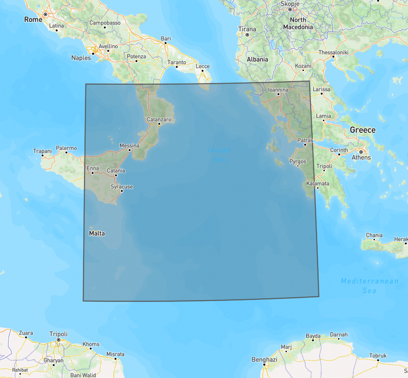
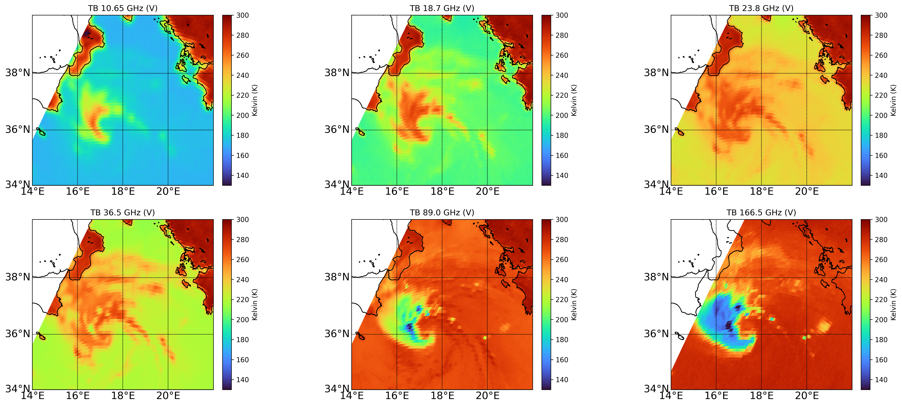
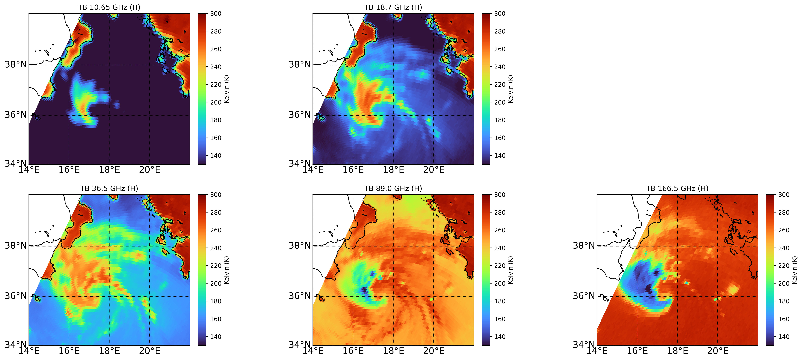
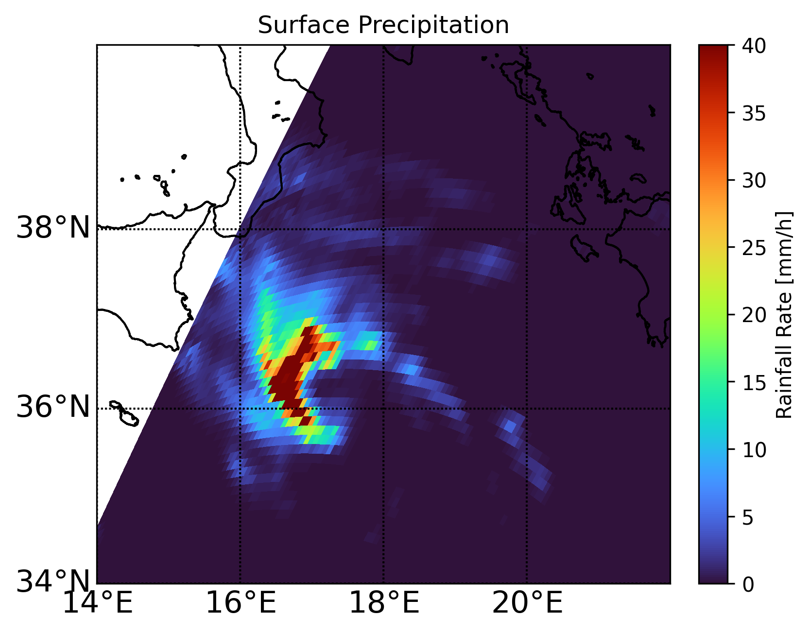

# ANN for Surface Precipitation Rate Estimation

Using data products from the Global Precipitation Measurement Mission (GPM) to train an Artificial Neural Network (ANN) for surface precipitation rate estimation. Train a Multilayer Perceptrons (MLP) Neural Network model:
- The model predicts the surface rain rate (RR), a.k.a. precipitation rate, given a set 13 channels for Brightness Temperature (TB) measurements.
- The model represents a simple Neural Network (NN) with two hidden layers and a final layer which is used to predict the target label.

This project is a follow up to the study done in [[1](https://github.com/ecmwf-projects/mooc-machine-learning-weather-climate), [2](https://www.sciencedirect.com/science/article/pii/S0169809522001600), [3](https://doi.org/10.1016/j.atmosres.2022.106174)]. Much of the source code and code comments are taken from [[1](https://github.com/ecmwf-projects/mooc-machine-learning-weather-climate)] and adapated or refactored for the purpose of furthering the model's prediction capabilities to cover land areas.

The model's estimation over land and coastal areas are not reliable because the training data does not include measurements over land. This project aims to tackle the complexities of precipitation retrieval over land and evaluate the resulting model's reliability over different land areas of interests.

Note that the models trained in this project use a small training dataset of 10 orbits and are thus unsuitable for operational applications.

The goals of this projects are to:
1. Familiarize with the [Global Precipitation Measurement Mission (GPM)](https://gpm.nasa.gov/missions/GPM) and the specification of its data products.
2. Understand the properties of the [GPM Microwave Imager (GMI)](https://gpm.nasa.gov/missions/GPM/GMI) channel frequencies and how to inrepret them into weather characteristics. For instance, at a central frequency of 36.5 GHz the TB measurements that are colder than background stem from the scattering by large and dense ice (e.g. hail – deep convection) [[3](https://doi.org/10.1016/j.atmosres.2022.106174)].
3. Understand how adding or removing some GMI channels from the training dataset affect the model's predictions. For instance, by removing or only considering the channels at a central frequency of 10.65 GHz since they are more directly impacted by surface precipitation where a TB warmer than background indicates emissions from large raindrops that are present in the lower rain layers [[3](https://doi.org/10.1016/j.atmosres.2022.106174)].
4. Appreciate the complexities of precipitation retrieval over land and how they hinder our ability to train a neural network for weather and climate predictions over land.

## Area of Interest
Two areas of interest (AOI) are selected to experiment with ANN for precipitation rate estimation over sea and land. The AOI over sea is taken from [[1](https://github.com/ecmwf-projects/mooc-machine-learning-weather-climate)]. The area over land is TBD.

### Over Sea
The AOI over sea is the Ionian Sea, as shown in Figure 1. A model will be trained to estimate the surface precipitation that occured during [Cyclone Ianos](https://en.wikipedia.org/wiki/Cyclone_Ianos), a.k.a Medicane Ianos.



**Figure 1: Area of interest over the Ionian Sea.**

### Over Land
The AOI over land will be an area in the path of Hurricane Ida's landfall. A model will be trained to estimate the surface precipitation during the hurricane in order to evaluate the challenges of predicting rainfall rate over land.

**Figure 2: TBD.**

## Mapped Data Products
Map the measurements taken by the GPM to better understand the data and its distribution across the entire AOI for both TB and surface precipitation measurements. The dataset was collected during Medicane Ianos, which occured on September 16, 2020. This dataset will not be used to train the model but will be used to compare against and evaluate the model's surface precipitation estimations given the same GMI inputs. The training data is taken from 10 GMI orbits on March 9, 2014.

### Brightness Temperature



**Figure 3: Vertically polarized GMI TB measurements over the Ionian Sea (September 16, 2020).**



**Figure 4: Horizontally polarized GMI TB measurements over the Ionian Sea (September 16, 2020).**

### Surface Precipitation (Rainfall Rate)
The surface precipitation during the Medicane Iano, shown in Figure 5, is what the model will attempt to estimate. The mapped values are taken from the NASA GMI/DPR Level 2 precipitation product (2B-CMB). Refer to [[6](https://gpm.nasa.gov/resources/documents/gpm-gprof-algorithm-theoretical-basis-document-atbd)] for details on the 2B-CMB algorithm used to determine the rainfall rate. These measurements will serve as the target values used to evaluate the model estimates given GMI TB inputs for the same day (mapped in Figures 3 and 4).



**Figure 5: Surface precipitation (rainfall rate) over the Ionian Sea (September 16, 2020).**

## Training the Artificial Neural Network
The model is trained using two hidden layers with 10 and 20 perceptrons, respectively. The training data is taken from 10 GMI orbits on March 9, 2014 (i.e. not during Medicane Ianos). Figure 6 plots the learning curves to make sure that there is no overfitting. Note that the curves do not reach asymptotic values, which suggests that further training may yield better results.


**Figure 6: Learning curves from training the ANN model.**

## Model Estimations
The model is given the GMI's 13 channels inputs collected during the Medicane Ianos (mapped in Figures 3 and 4). Figure 7 shows the model's output in estimating the surface precipitation. Comparing with the expected values previously mapped in Figure 5 reveals that the model under-estimates the surface precipitation. However, inaccurate predictions are expected considering the small sample size of the training data. The estimates are still useful in providing some insight into the pattern of the rainfall rate.


**Figure 7: Estimated surface precipitation (rainfall rate) over the Ionian Sea (September 16, 2020).**

## Next Steps / TODO
- Train a model with GMI and surface precipitation data over land.
- Run the model to estimate the surface precipitation of Hurricane Ida.
- Compare the estimates with the the values obtained from the 2B-CMB algorithm.
- Evaluate the challenges of predicting surface precipitation over land.

## References
[1] [ECMWF MOOC Machine Learning in Weather and Climate](https://github.com/ecmwf-projects/mooc-machine-learning-weather-climate).

[2] Sanò, P., Panegrossi, G., Casella, D., Marra, A.C., D'Adderio, L.P., Rysman, J.F., & Dietrich, S. (2018). [The Passive Microwave Neural Network Precipitation Retrieval (PNPR) Algorithm for the CONICAL Scanning Global Microwave Imager (GMI) Radiometer](https://www.sciencedirect.com/science/article/pii/S0169809522001600). _Remote Sens_, 10, 1122.

[3] D'Adderio L.P., Casella D., Dietrich S., Sanò P., & Panegrossi G. (2022). [GPM-CO observations of Medicane Ianos: Comparative analysis of precipitation structure between development and mature phase](https://doi.org/10.1016/j.atmosres.2022.106174). _Atmospheric Research_, Volume 273.

[4] [File Specification for GPM Products](https://gpm.nasa.gov/resources/documents/file-specification-gpm-products).

[5] [NASA PPS Storm website](https://storm.pps.eosdis.nasa.gov/storm/).

[6] [GPM GPROF Algorithm Theoretical Basis Document (ATBD)](https://gpm.nasa.gov/resources/documents/gpm-gprof-algorithm-theoretical-basis-document-atbd).

## Appendix: Getting Started
Instructions on how to prepare the virtual environment and install the Python package dependencies.

### Installation
Install the virtual environment:
```bash
pip install virtualenv
virtualenv venv
```

Activate the virtual environment in Linux:
```bash
source venv/bin/activate
```

In Windows:
```
.\venv\Scripts\activate
```

Install the application's Python package dependencies:
```
pip install -r requirements.txt
```

Deactivate the virtual environment:
```bash
deactivate
```

### Execution
Activate the virtual environment and execute the Python code.

Download the data products:
```bash
python 00_download_products.py
```

Map the Medicane Ianos GMI TB data:
```bash
python 01_map_products_gmi.py
```

Map the Medicane Ianos surface precipitation data:
```bash
python 02_map_products_precipitation.py
```

Train a model to predict the surface precipitation given the 13 channels for TB measurements:
```bash
python 03_train_sea_ann.py
```

Use the trained model to predict the surface precipitation during the Medicane Ianos:
```bash
python 04_predict_precipitation.py
```